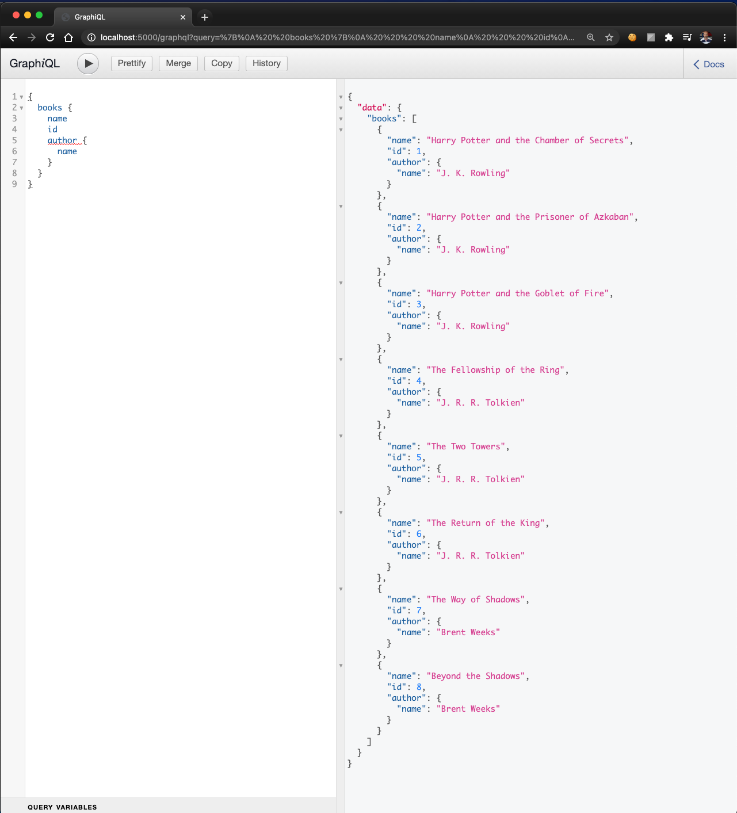
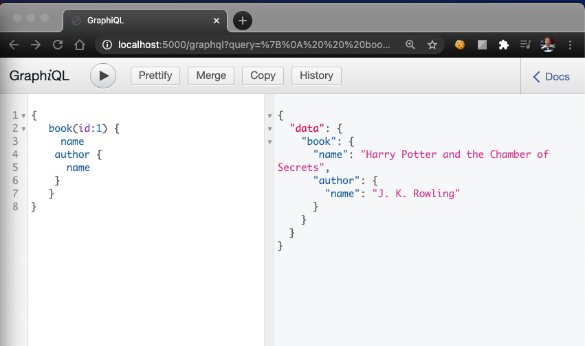
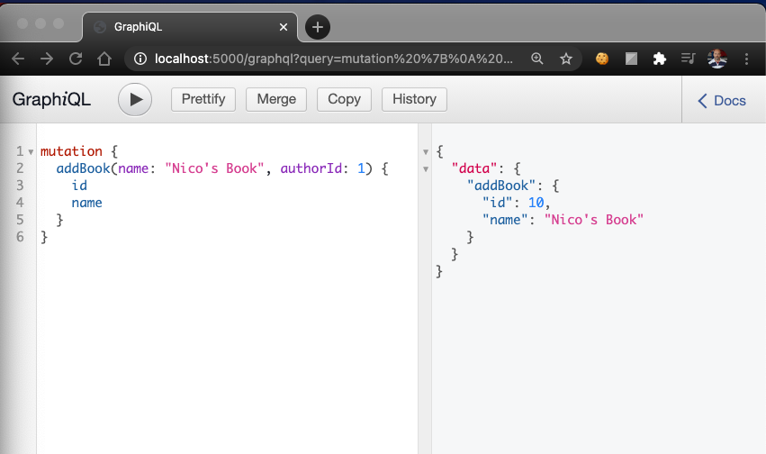

<div align="center">

# GraphQL Practice #1

## Node.js - Express. No database
<hr>
</div><br/>

### GraphQL practice using this tutorial:

[Learn GraphQL In 40 Minutes](https://www.youtube.com/watch?v=ZQL7tL2S0oQ) by [Web Dev Simplified](https://www.youtube.com/channel/UCFbNIlppjAuEX4znoulh0Cw)

I really like this tutorial. It was focused and the author expanded on each portion of the lesson to make it easier to understand.

## Installation

Download and install [node.js](https://nodejs.org/en/download/)

Open your terminal and complete the following tasks:

1. Create a new directory for your project
    `$ mkdir graphql_lesson`
2. In your terminal run the following command to create 'package.json' file.

    `$ npm init`
3. Install the following dependencies: 'express', 'express-graphql', and 'graphql' by running the following command.

    `$ npm i express express-graphql graphql`

4. Install 'nodemon':

    `$ npm i --save-dev nodemon`

5. Run server

    `$ npm run devStart`

6. To do queries navigate to

    `http://localhost:5000/graphql?`

7. Type `query {}` and do your query inside the brackets. Like in the examples below (see screenshot and code snipet)

``` graphql
query {
    books {
        name
        id
    }
}
```

<hr/>

## GraphiQL Screenshots

<p align="center">
<br/>
<small>sample graphiQL query</small>
</p>

<p align="center">
<br/>
<small>sample graphiQL query</small>
</p>

<p align="center">
<br/>
<small>sample graphiQL Create</small>
</p>